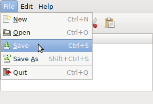
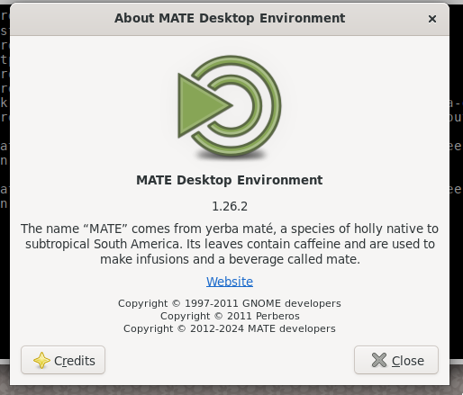
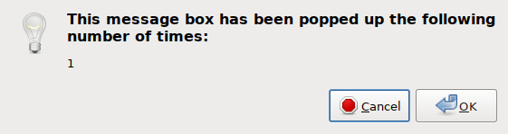

# gtk3-classic-module

This project provides a GTK module for GTK+ 3.24 to restore some of the
traditional look-and-feel of older GTK versions to GTK 3.  It is similar in
spirit to [gtk3-classic](https://github.com/lah7/gtk3-classic/), and in fact
much of the code in this module was inspired by the code from `gtk3-classic`;
however, this module does not require recompiling of GTK from source code.
You only need the development files for GTK; once this module is compiled, it
can be installed without replacing GTK entirely.

## Installation Instructions

You will need the Meson build system and the development files for GTK 3.
On Debian, Ubuntu, and their derivatives, type the following command to install
the build dependencies:

```
sudo apt install meson libgtk-3-dev
```

Download the source code for this module; `cd` into the directory into which
you downloaded it.  Then create a build directory and `cd` into that:

```
mkdir .build
cd .build
```

By default, it is assumed that GTK was installed into a prefix of `/usr`.  If
this is the case (it usually is), then you shouldn't need to supply any build
options:

```
meson setup ..
```

If GTK was installed into a diffeerent prefix -- for instance `/usr/local` --
add the `-Dprefix=[GTK-PREFIX]` option to the above `meson setup` command,
like so:

```
meson setup -Dprefix=/usr/local ..
```

Once the module is configured, build it and then install it:

```
meson compile
sudo meson install
```

You will need to restart all of your GTK applications before the module will
take effect.  If it doesn't then take effect, try running applications with the
environment variable `GTK_MODULES='gtk3-classic-module'` set.

Once installed, please check out your `/etc/gtk-3.0/settings.ini` file.  It
contains numerous useful settings which can be changed, complete with a large
amount of documentation about each option.

## What Does This Module Do?

* Applies stock icons to buttons and menu items which have standard text labels
  (example: 'Open...', 'Save As', 'Unlock').

  

  

  **Requires setting the GTK settings `gtk-button-icons` and/or
  `gtk-menu-icons`.**

* Always displays underlines beneath mnemonics, even when the <kbd>Alt</kbd>
  key is not being held down.  Normally, the mnemonics are displayed only when
  <kbd>Alt</kbd> is held down or when a menu is open and active.

  

  **Requires disabling the GTK setting `gtk-auto-mnemonics`.**

* Forces GTK to display normal dialog buttons at the bottom of stock dialogs
  (e.g. About dialog, color chooser, file chooser), instead of displaying the
  buttons in a headerbar at the top of the dialog -- even on Wayland.

  

* One of the settings in the installed `/etc/gtk-3.0/settings.ini` file,
  default disables overlay scrolling:  Scrollbars will always be displayed,
  instead of only appearing when you are about to use them.

  **Change the `gtk-overlay-scrolling` GTK setting to affect this behaviour.**

* Stock icon sizes are once again modifiable.  Now you can have buttons with
  24x24 icons instead of the tiny 16x16 icons that GTK 3 usually uses.

  **See the GTK setting `gtk-icon-sizes` for more information.**

* Text entry widgets do not display the 'Insert Emoji' item in the context
  menu.

  **Re-enable the menu item by setting the environment variable
  `GTKM_INSERT_EMOJI=1`.**

* Various dialogs have their old appearances restored, not the least of which
  is message dialogs:  They once again have an image next to the dialog text
  (if it's appropriate to include an image), the text is left- (or right-)
  justified instead of being centered, and dialog buttons don't appear all
  grouped together into one lump:

  

* The file chooser has the 'typeahead find' feature re-enabled, as opposed to
  the recursive search that GTK 3 normally performs.  Press
  <kbd>Alt</kbd>-<kbd>S</kbd> to launch the recursive search instead.

* The sizes of some widgets (mostly buttons) in the built-in GTK themes
  Adwaita and HighContrast have been reduced.

There may be other changes I have applied which I have forgotten to document
here.

## To-Do

* At least convert headerbars from a virtual titlebar for the window into a
  box at the top of the window content area.

* Maybe use simple heuristics to eliminate the headerbar entirely if it's only
  used as a deliberate forced-client-side-titlebar.

* Convert menu-like popovers into traditional menus.

* Restore 'zebra stripes' (alternating row colours in treeviews).

## License

GNU LGPL-3 or later.  This is a newer version of the same license under which
GTK 3 is released.
